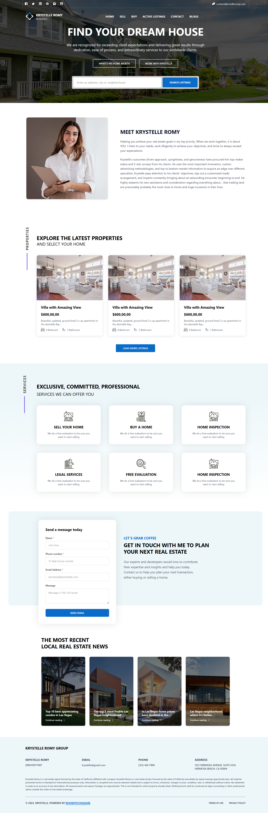

# Blogify

A modern, responsive blog and real estate website with contact functionality.

## 🚀 Deployment Links

- Frontend: [https://blogifyfrontend-phi.vercel.app/](https://blogifyfrontend-phi.vercel.app/)
- Backend: [https://blogifybackend-sable.vercel.app/](https://blogifybackend-sable.vercel.app/)

## 📷 Screenshots



## 🔧 Technologies Used

### Frontend

<p align="left">
  
  
  
  
</p>

### Backend

<p align="left">
  
  
  
</p>

### Deployment

<p align="left">
  
</p>

## 📂 Project Structure

```
Blogify/
├── frontend/                # Frontend React application
│   ├── src/
│   │   ├── assets/          # Images and static assets
│   │   ├── components/      # Reusable UI components
│   │   ├── pages/           # Page components
│   │   └── utils/           # Utility functions (including apiConfig.js)
│   ├── index.html           # HTML entry point
│   └── vercel.json          # Vercel deployment configuration
│
└── backend/                 # Backend Node.js application
    ├── controllers/         # Request handlers
    ├── models/              # Database models
    ├── routes/              # API route definitions
    ├── utils/               # Utility functions (including emailService.js)
    └── index.js             # Server entry point
```

## ⚙️ Installation & Setup

### Prerequisites

- Node.js (v14 or higher)
- MongoDB database

### Frontend Setup

1. Navigate to the frontend directory:

   ```
   cd frontend
   ```

2. Install dependencies:

   ```
   npm install
   ```

3. For local development, modify the API base URL in `src/utils/apiConfig.js`:

   ```javascript
   export const BASE_URL ="http://localhost:8080";
   ```

4. Start the development server:
   ```
   npm run dev
   ```

### Backend Setup

1. Navigate to the backend directory:

   ```
   cd backend
   ```

2. Install dependencies:

   ```
   npm install
   ```

3. add .env variables
   ```
   PORT = 8080
   MONGO_URI = mongodb://localhost:27017/
   EMAIL_USER = example@gmail.com
   EMAIL_PASS = examplepassword
   ```

4. Start the backend server:
   ```
   npm start
   ```

## 🌟 Features

### Responsive Design

- Fully responsive layout that adapts to all screen sizes
- Mobile-first approach for optimal user experience

### Contact Form

- Form validation for required fields
- Phone number validation (requires exactly 10 digits)
- Submission feedback message appears for 1.5 seconds
- Error handling with appropriate user feedback

## 📝 Usage

After installation, the frontend will be available at `http://localhost:5173` and the backend API at `http://localhost:8080`.

## 🚀 Deployment

The application is configured for deployment on Vercel:

- Frontend: Configured with vercel.json for proper client-side routing
- Backend: Deployed with CORS configured to allow requests from all origins

